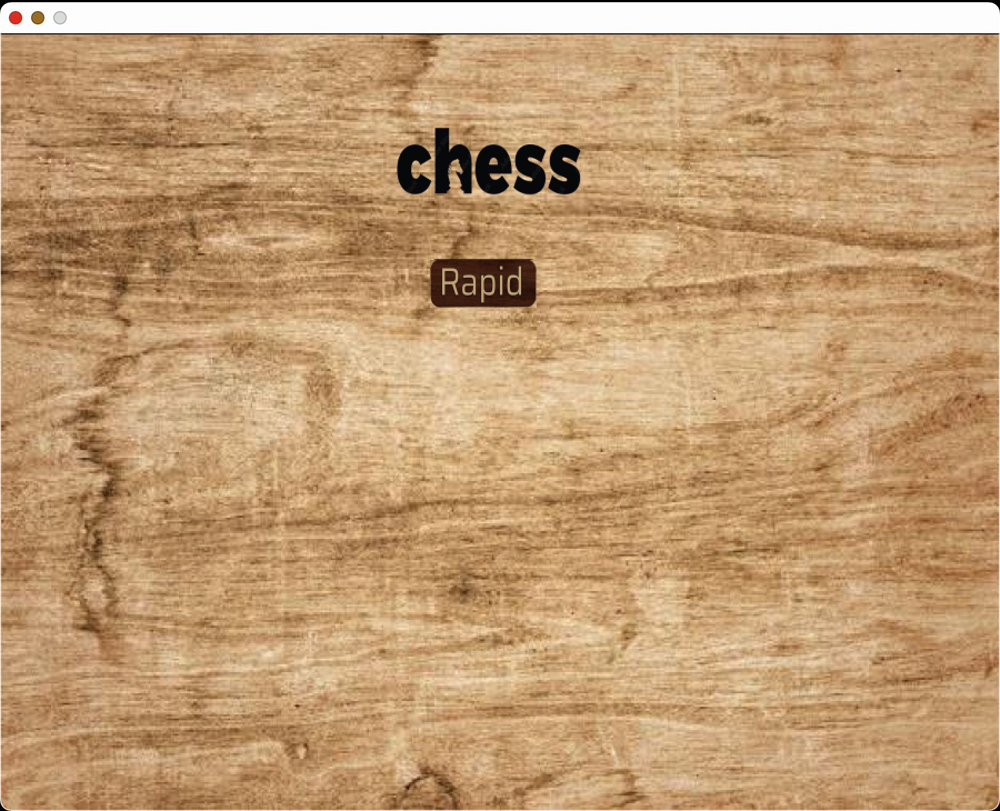
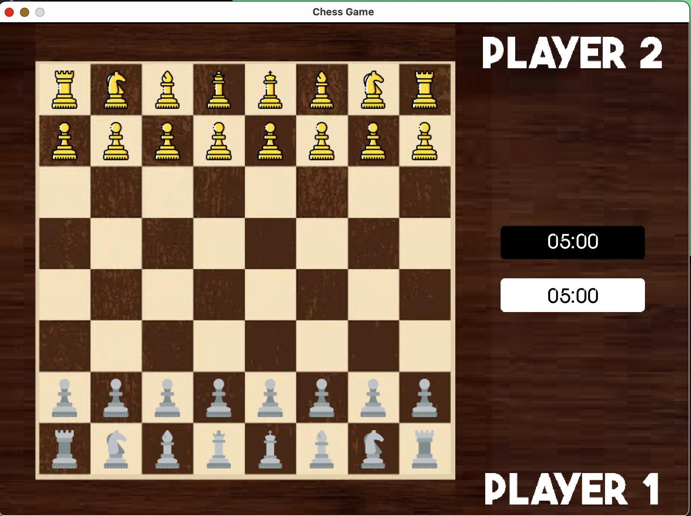
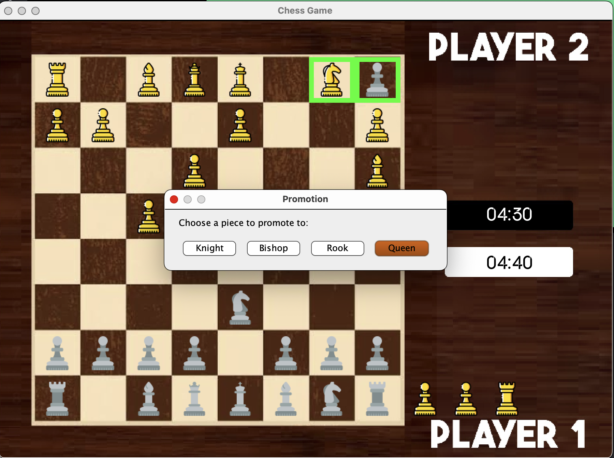
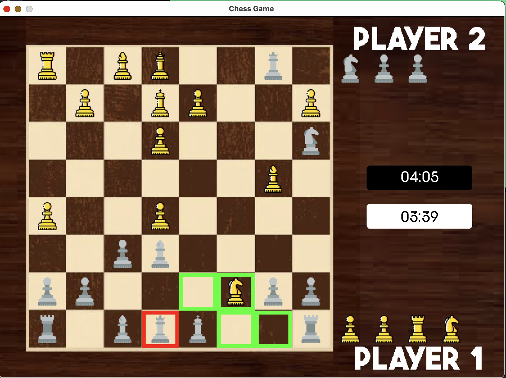
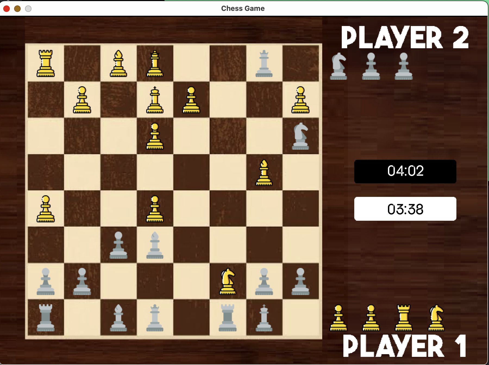
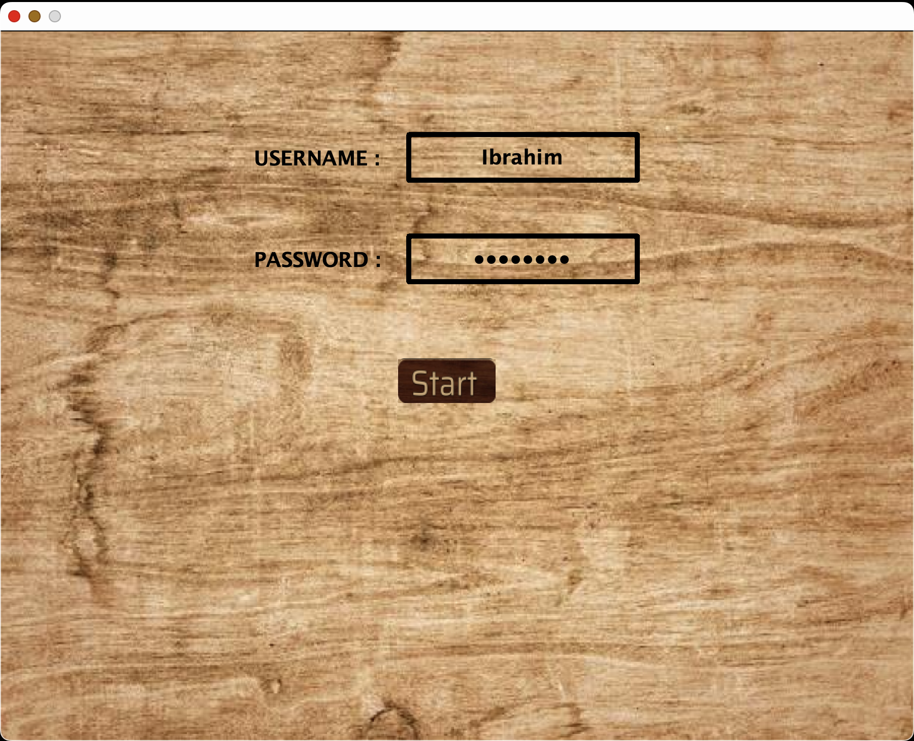

# Chess

## Overview

This project is an implementation of the all popular - and not at all complex :slightly_smiling_face: - chess game. The 
project is written entirely in Java, and follows the programing principles of Object-Oriented Programming (OOP).

## Features

### Pieces' movements:
This is not your average chess game, we made some spicy changes :yum:.
The changes we made to the pieces' movements include:
+ Bishop:
  + It can jump over pieces
  + It can move one horizontal square - to allow it to change the color of the diagonal
  + It can only move up to 3 squares diagonally.
+ Pawn:
  + The pawn in our project can eat pieces both diagonally and in front.
+ Knight:
  + The knight in our game moves in an L-shape, but it spans not your normal 2x1, but 3x2 squares. Pretty OP I think

### Basic gameplay:
The only game mode available for now is offline PvP, it includes:
+ Checkmate: Cause what's chess without checkmate :disguised_face:.
+ Timeout: We know those game can last a long time, so we prevented that lol.
+ Promotion: All the efforts of those pawns pay out at the end.

The game also includes some good ol` updates from the 15th Century:
+ Castling: Although given the new movement of the pieces, is it really worth it to trap your king in the corner 
:monocle_face:

### Quality of life:
We included a json file containing some usernames and passwords, those are used to login to accounts.

## Future work
The project of course is in need of more updates, not gameplay related of course (Chess hasn't been updated since the
early 19th century, and we plan on leaving it that way). We want to add:
+ A register page to register new users
+ A database to store all the users' information safely
+ The ability to save games and load them again later
+ PvE game mode:
  + This implies the use of complex algorithms to set the difficulty level of the computer. 
+ CrazyHouse game mode:
  + This is a game mode were captured pieces can be brought back by the player that made the capturing.
+ Stockfish Implementation:
  + We want to add the Stockfish API, to further enhance our game

